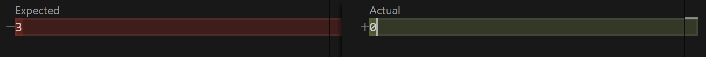

# Lab Report 3

## Part 1 - Bugs

**Failure Inducing Input**

```
@Test
public void testReversed2() {
  int[] input1 = { 1, 2, 3 };
  assertArrayEquals(new int[] { 3, 2, 1 }, ArrayExamples.reversed(input1));
}
```

**Non-Failure Inducing Input**

```
@Test
public void testReversed() {
  int[] input1 = {};
  assertArrayEquals(new int[] {}, ArrayExamples.reversed(input1));
}
```

**Screenshots of the Symptoms**




