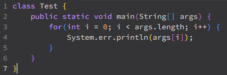
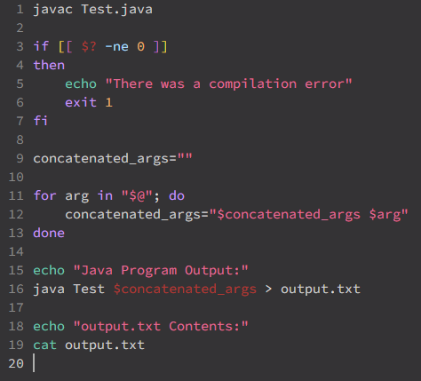
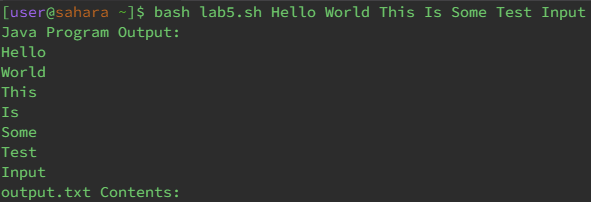

# Lab Report 3

**Student's Original Post**



I am having trouble with [bug] but I'm not exactly sure what it is. I used [failure-inducing input] as my input when the bug occurred so my guess is that input is the failure-inducing input.

**TA's Suggestion**

Hi, I see where your bug is. Have you tried doing [do something to solve the bug]?

**Student's Response**



Thank you! I tried what you suggested and I believe it fixed my issue. Above is a screenshot of what I got after trying out what you suggested.

## Setup Information

**Directory Structure**



**Contents of Files Before Fixing the Bug**

**[Filename].java**

```
Insert code here
```

**[Filename].sh**

```
Insert code here
```

**Command Used To Trigger Bug**

```
insert command here
```

**How To Fix The Bug**

[Insert Description Here]

## Reflection

In the second half of this quarter, I think the coolest thing I learned is bash. I find it really cool that we can create bash scripts that can automate things in the terminal. It was also interesting to see how Java and bash are quite different and even though the syntax for bash is extremely strange, I still enjoyed using it.
