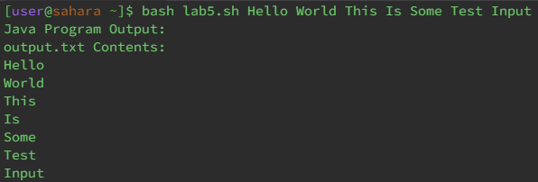
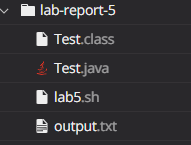

# Lab Report 3

**Student's Original Post**


I am having trouble with my bash script but I'm not exactly sure what it is. At first, it looks like the program is working but actually `output.txt` is empty even though I am redirecting my output from the Java program to `output.txt`. I used 7 random words (Hello World This Is Some Test Input) as my input when the bug occurred but other words that I have used also do not work. I'm very lost, please help 

**TA's Suggestion**

Hi, I see where your bug is. I don't actually see anything wrong with your bash script. Have you checked what output stream your Java program is outputting to?

**Student's Response**



Thank you! I didn't realize that my Java program was actually sending its output to the error stream. I fixed the bug and the output of my program now looks like this (image attached above). My `output.txt` file is also not empty anymore.

## Setup Information

**Directory Structure**



**Contents of Files Before Fixing the Bug**

**Test.java**

```
class Test {
    public static void main(String[] args) {
        for(int i = 0; i < args.length; i++) {
            System.err.println(args[i]);
        }
    }
}
```

**lab5.sh**

```
javac Test.java

if [[ $? -ne 0 ]] 
then
    echo "There was a compilation error"
    exit 1
fi

concatenated_args=""

for arg in "$@"; do
    concatenated_args="$concatenated_args $arg"
done

echo "Java Program Output:"
java Test $concatenated_args > output.txt

echo "output.txt Contents:"
cat output.txt
```

**Command Used To Trigger Bug**

```
$ bash lab5.sh Hello World This Is Some Test Input
```

**How To Fix The Bug**

In line 4 of `Test.java`, the output was being sent to the error stream. The bash script was redirecting the normal output stream to `output.txt` and hence the contents of `output.txt` was empty. To fix this, change the "err" in line 4 of `Test.java` to "out". 

## Reflection

In the second half of this quarter, I think the coolest thing I learned is bash. I find it really cool that we can create bash scripts that can automate things in the terminal. It was also interesting to see how Java and bash are quite different and even though the syntax for bash is extremely strange, I still enjoyed using it.
